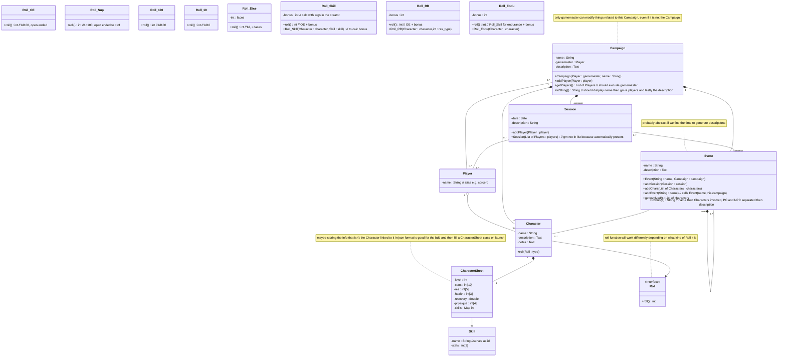

# JakartaDeRoll

```mermaid
classDiagram
    note for Campaign "only gamemaster can modify things related to this Campaign, even if it is not the Campaign."
    class Campaign{
        -name : String
        -gamemaster : Player
        -description : Text
        +Campaign(Player : gamemaster, name : String)
        +addPlayer(Player : player)
        +getPlayers() List of Players // should exclude gamemaster
        +toString() String // should dislplay name then gm & players and lastly the description
    }
    class Session{
        -date : date
        -description : String
        +addPlayer(Player : player)
        +Session(List of Players : players) // gm not in list because automatically present
    }
    note for Event "probably abstract if we find the time to generate descriptions"
    class Event{
        -name : String
        -description : Text
        +Event(String : name, Campaign : campaign)
        +addSession(Session : session)
        +addChars(List of Characters : characters)
        +addEvent(String : name) // calls Event(name,this.campaign)
        +getInvolved() List of characters
        +toString() String // name then Characters involved, PC and NPC separated then description 
    }
    class Player{
        -name : String // alias e.g. sorcero
    }
    class Character{
        -name : String
        -description : Text
        -notes : Text
        +roll(Roll : type)
    }
    note for CharacterSheet "maybe storing the info that isn't the Character linked to it in json format is good for the bdd and then fill a CharacterSheet class on launch"
    class CharacterSheet{
        -level : int
        -stats : int[10]
        -res : int[5]
        -health : int[3]
        -recovery : double
        -physique : int[4]
        -skills : Map<Skill.name> int
    }
    class Skill{
        -name : String //serves as id
        -stats : int[3]
    }
    Character "1\n-sheet" *-- "1" CharacterSheet
    Campaign "1" *-- "-campaign\n0..*" Session
    Event "-events\n1" *-- "0..*" Event
    Campaign "1" *-- "-campaign\n0..*" Event
    Session "0..*" -- "0..*" Event
    Campaign "0..*" -- "1..*" Player
    Player "1" o-- "-player\n0..*" Character
    Campaign "1" *-- "-campaign\n0..*" Character
    Event "0..*" -- "0..*" Character
    Session "0..*" -- "1..*" Player
    CharacterSheet --> Skill

    class Roll{
        <<Interface>>
        +roll() int
    }
    class Roll_OE{
        +roll() int //1d100, open ended
    }
    class Roll_Sup{
        +roll() int //1d100, open ended to +inf 
    }
    class Roll_100{
        +roll() int //1d100
    }
    class Roll_10{
        +roll() int //1d10
    }
    class Roll_Dice{
        -int : faces
        +roll() int //1d<x>, <x> = faces
    }
    class Roll_Skill{
        -bonus : int // calc with args in the creator
        +roll() int // OE + bonus
        +Roll_Skill(Character : character, Skill : skill) // to calc bonus
    }
    class Roll_RR{
        -bonus : int
        +roll() int // OE + bonus
        +Roll_RR(Character : character,int : res_type)
    }
    class Roll_Endu{
        -bonus : int
        +roll() int // Roll_Skill for endurance + bonus
        +Roll_Endu(Character : character)
    }

    Character --> Roll
    
    note for Roll "roll function will work differently depending on what kind of Roll it is"
```