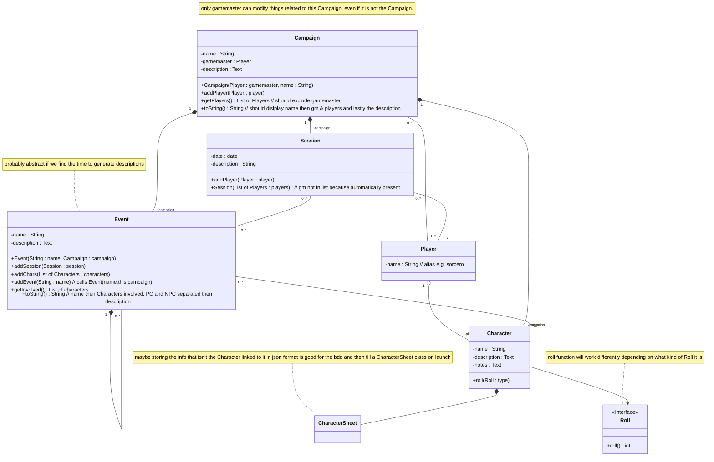

# JakartaDeRoll

```mermaid
classDiagram
    note for Campaign "only gamemaster can modify things related to this Campaign, even if it is not the Campaign."
    class Campaign{
        -name : String
        -gamemaster : Player
        -description : Text
        +Campaign(Player : gamemaster, name : String)
        +addPlayer(Player : player)
        +getPlayers() List of Players // should exclude gamemaster
        +toString() String // should dislplay name then gm & players and lastly the description
    }
    class Session{
        -date : date
        -description : String
        +addPlayer(Player : player)
        +Session(List of Players : players) // gm not in list because automatically present
    }
    note for Event "probably abstract if we find the time to generate descriptions"
    class Event{
        -name : String
        -description : Text
        +Event(String : name, Campaign : campaign)
        +addSession(Session : session)
        +addChars(List of Characters : characters)
        +addEvent(String : name) // calls Event(name,this.campaign)
        +getInvolved() List of characters
        +toString() String // name then Characters involved, PC and NPC separated then description 
    }
    class Player{
        -name : String // alias e.g. sorcero
    }
    class Character{
        -name : String
        -description : Text
        -notes : Text
        +roll(Roll : type)
    }
    note for CharacterSheet "maybe storing the info that isn't the Character linked to it in json format is good for the bdd and then fill a CharacterSheet class on launch"
    class CharacterSheet{
    }
    Character "1\n-sheet" *-- "1" CharacterSheet
    Campaign "1" *-- "-campaign\n0..*" Session
    Event "1" *-- "0..*" Event
    Campaign "1" *-- "-campaign\n0..*" Event
    Session "0..*" -- "0..*" Event
    Campaign "0..*" -- "1..*" Player
    Player "1" o-- "-player\n0..*" Character
    Campaign "1" *-- "-campaign\n0..*" Character
    Event "0..*" -- "0..*" Character
    Session "0..*" -- "1..*" Player
    Character --> Roll

    class Roll{
        <<Interface>>
        +roll() int
    }
    note for Roll "roll function will work differently depending on what kind of Roll it is"
```